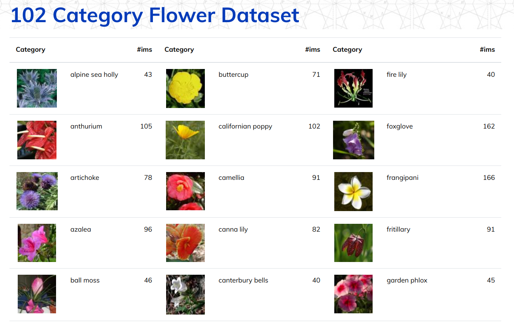

#### AI Programming with Python Project

In this project, I implemented an image classifier using PyTorch. The model is trained on the [Oxford 102 Category Flower Dataset](https://www.robots.ox.ac.uk/~vgg/data/flowers/102/index.html), which contains 102 different flower species.

After training, I created a command-line application that allows users to:

- Train the classifier on custom datasets
- Save and load checkpoints
- Perform inference on new images
- Predict the top K most likely classes for a given input image

